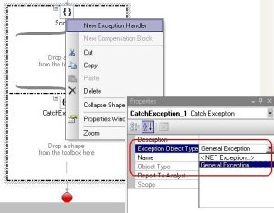
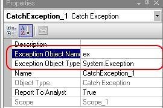

# Handling Exceptions inside BizTalk Orchestrations
# Introduction
Handling exceptions inside orchestration is the equivalent of doing a **catch { }** block in C#, of course, there are some little differences, but the idea is the same.

# General Exception Type
When we create **New Exception Handler**, in property **Exception Object Type** combobox, the only item in the list is **General Exception**:

Think of catching a **Generic Exception** as the equivalent of doing a **catch { }** block in C# with no exception declared. **General Exception** allows BizTalk to deal with any exception it may catch and re-throw, there’s no way to get the exception message at that point.

# How can I get Exception Message
You can accomplish this by changing the exception type to **System.Exception** or another type like **System.Web.Services.Protocols.SoapException**:
* In **Exception Object Type** property select: **<.NET Exception…>**
* In Artifact Type windows, select **System.Exception**

By selecting another type, you are able to define **Exception Object Name**, in this case, **ex**, and then for getting the error message is just like C#: **ex.Message** or **ex.ToString()**.

See sample one on this project.

# Handling Delivery Failure Exception (using a request-response port)

There is a great post by [Naveen Karamchetti](https://www.codeproject.com/Articles/13576/A-developers-guide-to-handling-exceptions-in-BizTa) about this; this is the key steps…

In order to catch an exception within your scope block in BizTalk while using a request-response port, you might have to do the following:
* Set the retry-count to **0** on your physical request-response port which you use to bind.
* Enable the flag Delivery Notification to ‘Transmitted’ on your logical request-response port within the orchestration.
* Catch the **Microsoft.XLANGs.BaseTypes.DeliveryFailureException** exception and handle it has you please.

The Delivery Notification flag on the Send Port indicates that the orchestration must be NOTIFIED back, in case the message has not been received by the destination. Delivery Notification works only when the Retry Count set to **0**.

When a message cannot be delivered, a Delivery Failure Exception is raised and the exception needs to be handled by the Orchestration.

# Handling SOAP Exception
Similar to Delivery Failure, but in this case, we have to configure the Exception with “System.Web.Services.Protocols.SoapException”.

Note: remember to set the retry-count to **0**.

To get an error message, just: **ex.Detail.InnerText**

See sample two in this project.

# Read more about it
You can read more about this topic here: [BizTalk Training – Handling Exceptions inside orchestration](https://blog.sandro-pereira.com/2009/10/26/biztalk-training-handling-exceptions-inside-orchestration/)

# About Me
**Sandro Pereira** | [DevScope](http://www.devscope.net/) | MVP & MCTS BizTalk Server 2010 | [https://blog.sandro-pereira.com/](https://blog.sandro-pereira.com/) | [@sandro_asp](https://twitter.com/sandro_asp)

