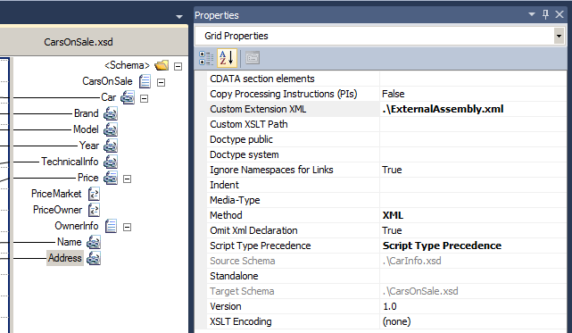

# Calling an external assembly from Custom XSLT in BizTalk Server Maps

# Introduction
So is usual in complex maps to have scripting functoid with custom inline XSLT, and sometimes is useful to call custom .Net components directly from XSLT.

# Building the Sample
To illustrate this functionality, I decided to create a Class Library project: MapperExtensionsFunctions with a simple class where it is implemented a method to format the numbers in three decimal places:

    
    using System; 
	using System.Collections.Generic; 
	using System.Linq; 
	using System.Text; 
	using System.Globalization; 
	 
	namespace MapperExtensionsFunctions 
	{ 
		public class MappingFunctions 
		{ 
			public MappingFunctions() 
			{ 
			} 
	 
			public string ToDecimalPoint(string Input) 
			{ 
				CultureInfo ciEN = new CultureInfo("en-US", false); 
	 
				double ConvertionDouble = double.Parse(Input, ciEN); 
				string Output = string.Format("{0:0.000}", ConvertionDouble); 
				return Output; 
			} 
		} 
	}
    

### How can we extend BizTalk map to support this functionality?

You can add a custom extension xml file to your solution in order to declare the namespace and use a method from a .Net assembly from XSLT.

The extension file should look something like this: 

    
    <ExtensionObjects> 
	  <ExtensionObject Namespace="http://schemas.microsoft.com/BizTalk/2003/ScriptNS0" AssemblyName="MapperExtensionsFunctions, Version=1.0.0.0, Culture=neutral, PublicKeyToken=cdbffba4cc751306" ClassName="MapperExtensionsFunctions.MappingFunctions" /> 
	</ExtensionObjects> 
    

> Note: **http://schemas.microsoft.com/BizTalk/2003/ScriptNS0** is the **default namespace**, However you can change it (see more [here](https://docs.microsoft.com/en-us/biztalk/core/technical-reference/custom-extension-xml-grid-property))

In the properties of your BizTalk Mapper, use the **Custom Extension XML** property to open the **Select Custom Extension XML File** dialog box, in which you can select the file that contains the custom extension XML for the map (file above).

Finally in your Inline XSLT functoid you can use the methods from the assembly by:

    
    <xsl:variable name="result" xmlns:ScriptNS0="http://schemas.microsoft.com/BizTalk/2003/ScriptNS0" select="ScriptNS0:ToDecimalPoint(MarketPrice/text())" />
    

Or in this case, inside Inline XSLT Call Template:

    
    <xsl:template name="PriceTemplate"> 
	  <xsl:param name="market" /> 
	  <xsl:param name="owner" /> 
	  <xsl:element name="Price"> 
		<xsl:variable name="pmarket" xmlns:ScriptNS0="http://schemas.microsoft.com/BizTalk/2003/ScriptNS0" select="ScriptNS0:ToDecimalPoint($market)" /> 
		<xsl:variable name="powner" xmlns:ScriptNS0="http://schemas.microsoft.com/BizTalk/2003/ScriptNS0" select="ScriptNS0:ToDecimalPoint($owner)" /> 
		<PriceMarket> 
		  <xsl:value-of select="$pmarket" /> 
		</PriceMarket> 
		<PriceOwner> 
		  <xsl:value-of select="$powner" /> 
		</PriceOwner> 
	  </xsl:element> 
	</xsl:template>
    
 
### Houston we have a problem!
After Build, deploy and configure my project with success I decided to test my solution, but I keep getting the following error:

> The Messaging Engine failed while executing the inbound map for the message coming from source URL:"C:\TEMP\PORTS\IN_CAR\*.xml" with the Message Type "http://BizTalk.CallingExternalAssemblyFromInlineXSLT.CarInfo#CarProperty". Details:"Cannot find the script or external object that implements prefix 'ScriptNS0'."

At first glance, this error suggests that the assembly in question is not published in the GAC… However even after re-publish, the assembly in the GAC the problem remained

Don’t panic, believe it or not, you did everything right… BizTalk Server <version>/Visual Studio <version> have a bug (or issue): Visual Studio does not persist the path of Custom Extension XML property in the .BTM file.

So if someone wishes to use an external assembly in via a Inline XSLT/XSLT Template scripting functoid they cannot specify the external assembly through an extension xml file.

I tried to install the latest cumulative update package for BizTalk (CU5) and Visual Studio service pack but the issue still remain active.

#### Workaround (unfortunately it's manual)
You need to manually edit .BTM file to add this node between the elements **</ScriptTypePrecedence>** and **<TreeValues>**:

    
    <CustomXSLT XsltPath="" ExtObjXmlPath=".\xslt\ExternalAssembly.xml" />
    

> Note: Is not mandatory the CustomXSLT node stand between the elements **</ScriptTypePrecedence>** and **<TreeValues>** however this is normal behavior of the compiler.
 

#### Workaround 2 (automatic)
Using PowerShell script associated with the Pre-build actions of Visual Studio project will automatically fix this issue for us.

PowerShell script available for download on TechNet Gallery [here](https://gallery.technet.microsoft.com/BizTalk-Mapper-Custom-3050cb3e).

The script accepts two parameters:
* The first parameter is the path to the map that we want to configure the custom extension XML;
* The second is the path to the ExternalAssembly.xml file file that refers the namespace to the FullyQualifiedName (FQN) of the .NET assembly.

Then we need to configure Pre-build actions of Visual Studio project to run this script:
* Copy the PowerShell script file: ExternalAssembluFix.ps1 to your project directory;
* Right-click on BizTalk project name and select “Properties” option;
* On the right three choose “Build Events” option:
  * Select the button “Edit Pre-Build …” and in the “Pre-Build event command line” windows type the following command:

    
    Powershell -File "$(ProjectDir)ExternalAssemblyFix.ps1" "$(ProjectDir)<name_of_the_map>" "$(ProjectDir)ExternalAssembly.xml"
    

> Note: you must replace <name_of_the_map> with the name of your map.
 
# Read more about it
You can read more about this topic here: [BizTalk Mapper: Custom Extension XML property fixed with PowerShell script (BizTalk 2010)](https://blog.sandro-pereira.com/2012/07/30/biztalk-mapper-custom-extension-xml-property-fixed-with-powershell-script-biztalk-2010/)

# About Me
**Sandro Pereira** | [DevScope](http://www.devscope.net/) | MVP & MCTS BizTalk Server 2010 | [https://blog.sandro-pereira.com/](https://blog.sandro-pereira.com/) | [@sandro_asp](https://twitter.com/sandro_asp)