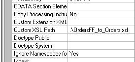
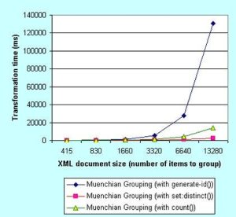

# Muenchian Grouping and Sorting in BizTalk Maps without losing Map functionalities
# Introduction
Searching for all the preceding siblings with the 'preceding-siblings' axis takes a long time if you're near the end of the records, this involves looking at every single contact each time which this method very inefficient.

The Muenchian Method is a method developed by Steve Muench for performing grouping and sorting functionalities in a more efficient way using keys.  Keys work by assigning a key value to a node and giving you easy access to that node through the key value.  If there are lots of nodes that have the same key value, then all those nodes are retrieved when you use that key value.  Effectively this means that if you want to group a set of nodes according to a particular property of the node, then you can use keys to group them together.

There is an astonishing post by Chris Romp about [Muenchian Grouping and Sorting in BizTalk Maps](https://blogs.msdn.microsoft.com/chrisromp/2008/07/31/muenchian-grouping-and-sorting-in-biztalk-maps/), but it has one limitation, by creating and configures Custom XSL Path we lose all mapping features.

**So how can we use Muenchian Grouping without losing Map features?**

# Building my first approach
**My First approach**: Was try to put an Inline XSLT functoid and put all the XSL inside

<xsl:key name=”groups” match=”Order” use=”OrderId”/>
<!– This will loop through our key (“OrderId”) –>
<xsl:for-each select=”Order[generate-id(.)=generate-id(key('groups',OrderId))]“>
<!– And let’s do some sorting for good measure… –>
<xsl:sort select=”OrderId” order=”ascending”/>
<Order>
<OrderId><xsl:value-of select=”OrderId/text()” /></OrderId>
<Items>
<!– Another loop… –>
<xsl:for-each select=”key(‘groups’,OrderId)”>
<ItemId><xsl:value-of select=”ItemId” /></ItemId>
</xsl:for-each>
</Items>
</Order>
</xsl:for-each>
 
The problem with that approach is that gives an error:
* XSLT compile error at (9,8). See InnerException for details. ‘xsl:key’ cannot be a child of the ‘ns0:OutputOrder’ element

So, to avoid this error we need to separate “<xsl:key name=”groups” match=”Order” use=”OrderId”/>” expression from the rest of the XSL (see second approach)

# Building the right approach and solving the problem
Add two scripting functoids to the map
* In the first, configure to an “Inline XSLT Call Template” and put key expression
  * <xsl:key name=”groups” match=”Order” use=”OrderId”/>
* In the second, configure to an “Inline XSLT” and the rest of the XSL
  * <!– This will loop through our key (“OrderId”) –>
	<xsl:for-each select=”Order[generate-id(.)=generate-id(key('groups',OrderId))]“>
	<!– And let’s do some sorting for good measure… –>
	<xsl:sort select=”OrderId” order=”ascending”/>
	<Order>
	<OrderId><xsl:value-of select=”OrderId/text()” /></OrderId>
	<Items>
	<!– Another loop… –>
	<xsl:for-each select=”key(‘groups’,OrderId)”>
	<ItemId><xsl:value-of select=”ItemId” /></ItemId>
	</xsl:for-each>
	</Items>
	</Order>
	</xsl:for-each>

See Sample 1, map “MapOrder.btm” 

# How can we improved (a little more) this solution

When leading with large files, speed processing is vital. Classical Muenchian grouping use generate-id(). Muenchian grouping using generate-id() is slowest that using count() function, and shows worst scalability. Probably the reason is poor generate-id() function implementation. In other words, count() function performs is much better.

So to improve Meunchian a little more we have to use count() function instead of generate-id():
* <xsl:for-each select=”Order[count(. | key('groups',OrderId)[1]) = 1]”>
* See Sample 1, map “MapOrder2.btm”

Here some performance stats that I found (see original post):

The graph view works better:

# Read more about it
You can read more about this topic here: [BizTalk Training – Mapping – Muenchian Grouping and Sorting in BizTalk Maps without losing Map functionalities
](https://blog.sandro-pereira.com/2009/10/28/biztalk-training-mapping-muenchian-grouping-and-sorting-in-biztalk-maps-without-losing-map-functionalities/)

# About Me
**Sandro Pereira** | [DevScope](http://www.devscope.net/) | MVP & MCTS BizTalk Server 2010 | [https://blog.sandro-pereira.com/](https://blog.sandro-pereira.com/) | [@sandro_asp](https://twitter.com/sandro_asp)

