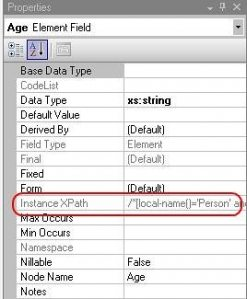
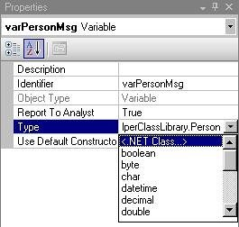

# Accessing and change message values inside orchestration
# Introduction
There are 3 ways that we can read and set values of the message inside orchestration:
* Using Property promotion
* Using XPath expressions
* Using C#/VB.NET object (serialization)

The last one is the most uncommon but it can be done, serializing the message into object.

# Using Property promotion
Property promotion is about getting easy and fast access to data.
* **Easy**: Because you typically do not have to know anything about your data to get access to it. Rather than some long XPath query with possible errors.
* **Fast**: Because you do not have to load the whole message into memory to get access to the data. It is placed inside the message context (a collection of key-value pairs that are associated with a message).

BizTalk provides two different types of promoted properties based on what you want to do with the data. The two types are:
* Promoted Properties: are system wide.
* Distinguished Fields: are light weight and only accessible inside an Orchestration.

They are read/write so it provides an easy way to change values inside your message without using a map – such as updating a status field.

Learn more: [Distinguished Fields vs. Promoted Properties](https://blog.sandro-pereira.com/2009/03/28/distinguished-fields-vs-promoted-properties/), [Basics of Promoted Properties](http://geekswithblogs.net/sthomas/archive/2005/06/27/44906.aspx)

## Using Promoted Properties:

    
    //Read
    System.Diagnostics.EventLog.WriteEntry(“Orchestration”, System.Convert.ToString(
    msgOutput1(AccessingAndChangeMessageValuesInOrchestration.PropertySchema.FirstName)), System.Diagnostics.EventLogEntryType.Error);
    
    //SET (Write)
    msgOutput1(AccessingAndChangeMessageValuesInOrchestration.PropertySchema.FirstName) = “Sandro”;
    
    Using Distinguished Field:
    
    //Read
    System.Diagnostics.EventLog.WriteEntry("Orchestration", System.Convert.ToString(msgOutput2.LastName), System.Diagnostics.EventLogEntryType.Error);
    
    //SET (Write)
    msgOutput2.LastName = “Pereira”;
    
## Using XPath expressions

Working with XPath inside Orchestrations is a powerful and simple feature of BizTalk. XPath can be used to both read values and set values inside your Message. To set values in your message, you need to be inside a Message Construct shape.

XPath queries can only be done against a Message – can also be executed against untyped messages (that is, a Message that is of type System.Xml.XmlDocument) – and the results can be set to a Message, XML Document or other orchestration variables.

Learn more: [XPath 1.0 Function Library Quick Reference](https://blog.sandro-pereira.com/2009/08/29/biztalk-working-with-xpath-xpath-1-0-function-library-quick-reference/), [Operators and Special Characters Quick Reference](https://blog.sandro-pereira.com/2009/08/29/biztalk-working-with-xpath-xpath-1-0-operators-and-special-characters-quick-reference/)

To see what is the XPath expression of the field:
* Go to schema and select the field that you want
* Right-click and select **Properties**
* Select the value of the property **Instance XPath**

## Using XPath Expression in Message Assign:
    
    //Read
    System.Diagnostics.EventLog.WriteEntry(“Orchestration”, System.Convert.ToString(xpath(msgOutput3,”string(/*[local-name()='Person' and namespace-uri()='http://AccessingAndChangeMessageValuesInOrchestration.Schema1']/*[local-name()='Age' and namespace-uri()=''])”)), System.Diagnostics.EventLogEntryType.Error);
    
    //SET (Write)
    xpath(msgOutput3,”/*[local-name()='Person' and namespace-uri()='http://AccessingAndChangeMessageValuesInOrchestration.Schema1']/*[local-name()='Age' and namespace-uri()='']“) = “00″;
    

## Using C#/VB.NET object (serialization)
BizTalk is able to automatically convert message in C# object and C# object into BizTalk message.

To accomplish this we have to generate C#/VB.NET classes based on Schemas using XSD.EXE, or those of you not familiar with XSD.EXE it’s a command line tool shipped with Visual Studio .NET that allows you to generate Classes or Typed DataSets based on XML Schemas, normally you might try to write code to create a XML Document (based on a schema), you end up writing pages and pages of painful code to construct a XML document by using the DOM (XmlDocument).

How to create class from schema:
* Start Menu -> All Programs -> Microsoft Visual Studio … -> Visual Studio Tools -> Visual Studio … Command Prompt
* Go to the Schema folder and type “xsd /classes /language:CS Schema1.xsd”

Create Orchestration variable
* First you have to create an orchestration variable from the class that you create previous
* On property Type select <.NET Class…> and select Person class that you create previous

Using C# object inside Message Assign:
    
    //CONVERT MESSAGE INTO C# OBJECT
    varPersonMsg = msgInput;
    
    //Read
    System.Diagnostics.EventLog.WriteEntry(“Orchestration”, varPersonMsg.FirstName + ” ” + varPersonMsg.LastName, System.Diagnostics.EventLogEntryType.Error);
    
    //SET (Write)
    varPersonMsg.FirstName = “Sandro”;
    varPersonMsg.LastName = “Pereira”;
    varPersonMsg.Age = “00″;
    
    //CONVERT C# OBJECT INTO BIZTALK MESSAGE
    msgOutput4 = varPersonMsg;
    
# Read more about it
You can read more about this topic here: [BizTalk Training – Accessing and change message values inside orchestration](https://blog.sandro-pereira.com/2009/10/26/biztalk-training-accessing-and-change-message-values-inside-orchestration/)

# About Me
**Sandro Pereira** | [DevScope](http://www.devscope.net/) | MVP & MCTS BizTalk Server 2010 | [https://blog.sandro-pereira.com/](https://blog.sandro-pereira.com/) | [@sandro_asp](https://twitter.com/sandro_asp)

