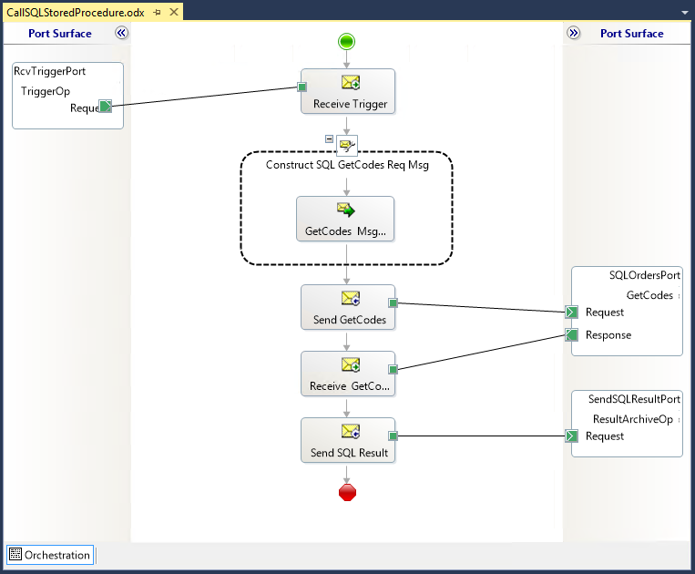

# BizTalk Server: How to call a SQL Stored procedure without inputs

# Introduction
In the last few months, in with I find myself migrating several projects from previous BizTalk versions to BizTalk Server 2013 R2 and revising/improving others, I have seen crazy ways to invoke a service or a stored procedure that don’t accept any inputs/parameters, for example: a stored procedure that gets all the existing codes from a SQL table.

Taking this sample, call a stored procedure that gets all the existing codes from a SQL table, let’s see all the approach that I found, why you shouldn’t do some of them and what’s the best approach to achieve this requirement in BizTalk Server. But be aware that **all of these approaches actually works**, of course, one better than others.

# Building the Sample
In this proof-of-concept (PoC) we will have a simple SQL Server table called Codes that only contains a code identifier that is unique in the system, as you can see picture bellow and, once again, we will try to call a stored procedure that gets all the existing codes from that specific SQL table.

For all the approach in this PoC, basically what we will do is create an orchestration that:
* Receive a message that will trigger an orchestration
* It can be by using the scheduler adapter to send a message to trigger the orchestration;
* Or using a file adapter in which we will drop a message in a particular folder in our file system;
* Create the SQL stored procedure GetCodes request message
* Call the stored procedure and receive the response
* And send the stored procedure result to an archive folder in or file system

# Read more about it
You can read more about this topic here: [Thinking outside the box (or not): How to properly call a SQL stored procedure without any input parameters?](https://blogs.biztalk360.com/how-to-call-a-sql-stored-procedure-without-any-input-parameters/)

# About Me
**Sandro Pereira** | [DevScope](http://www.devscope.net/) | MVP & MCTS BizTalk Server 2010 | [https://blog.sandro-pereira.com/](https://blog.sandro-pereira.com/) | [@sandro_asp](https://twitter.com/sandro_asp)

